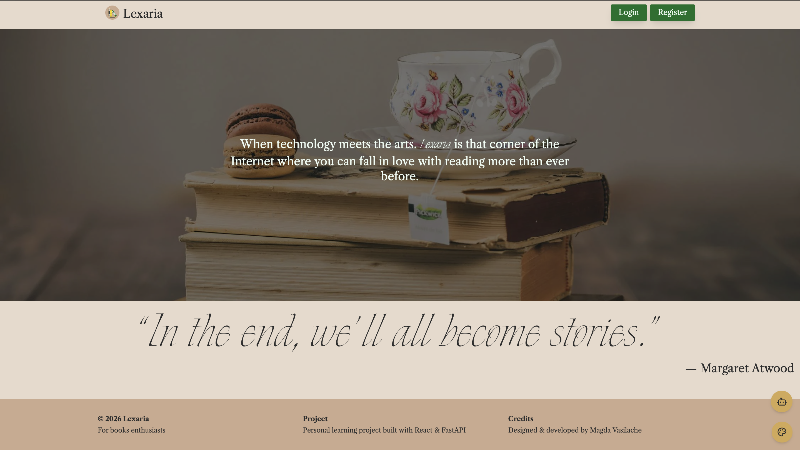
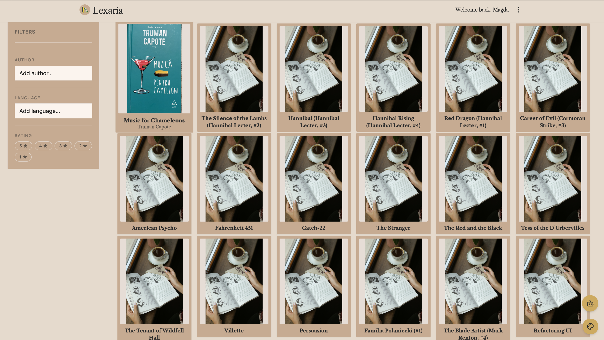
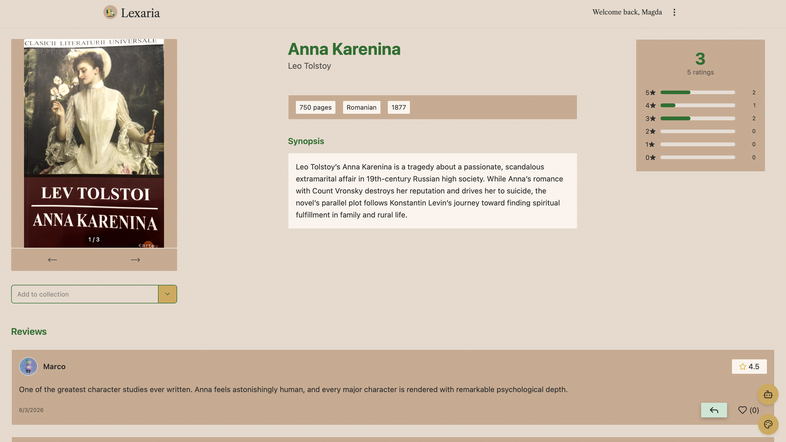
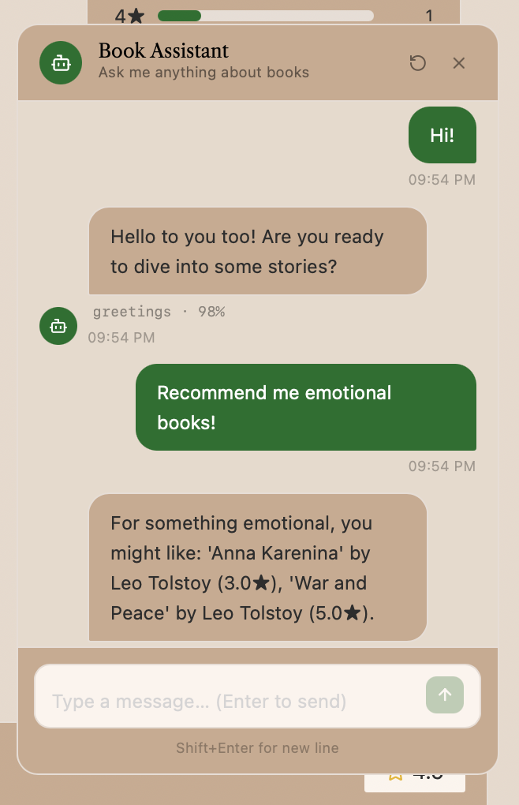

# Lexaria

Lexaria is a full-stack web application built as a technical project focused on modern frontend state management, scalable backend architecture, and a lightweight AI chatbot integration for book discovery.

The main goal of the project is to demonstrate clean separation of concerns between frontend and backend, efficient API handling using React Query and Zustand, and a FastAPI-based service layer.

## Key Focus

- Frontend state management with Zustand
- Server state handling and caching with TanStack Query
- REST API built with FastAPI
- Clean separation between client and server
- Simple rule-based chatbot layer for natural language book queries

## Tech Stack

### Frontend
- React
- TypeScript
- TanStack Query
- Zustand
- TailwindCSS

### Backend
- FastAPI
- Python
- Pydantic
- SQLAlchemy
- JWT authentication

### Database
- PostgreSQL

### AI Layer
- Lightweight chatbot using intent matching and simple NLP rules
- Trained model (`chatbot.pth`) used for basic classification

## Architecture Overview

Lexaria follows a clear client-server architecture:

### Frontend Responsibilities
- UI rendering and interaction
- Global client state (Zustand)
- Server state management (TanStack Query)
- API communication layer

### Backend Responsibilities
- Authentication and authorization
- Business logic
- Database access layer
- API endpoints
- Basic chatbot inference endpoint

### Data Flow
1. User interacts with UI
2. Zustand manages local UI state
3. TanStack Query handles API requests, caching, and synchronization
4. FastAPI processes requests and interacts with the database
5. AI layer, a chatbot that interprets simple natural language queries

## Core Concept

The application is primarily a technical showcase of frontend architecture patterns and backend structuring.

Example user inputs:
- “Books similar to 1984”
- “Fantasy recommendations”
- “Horror novels”

These are processed through a lightweight intent system and mapped to backend queries.

